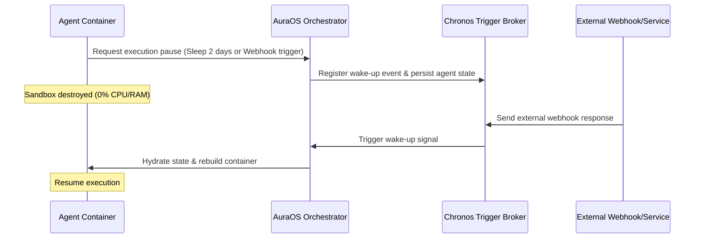

# AuraOS Architecture Ideas & R&D Roadmap (IDEA.md)

This document contains design explorations, experimental architectures, and research pathways for the core components of the AuraOS Agentic Runtime Environment.

---

## 1. Cognitive Sandbox: WebAssembly vs. Firecracker vs. Micro-Docker

To isolate dynamically generated agent code, we are evaluating three distinct sandboxing architectures:

| Isolation Tech | Startup Time | Memory Footprint | Resource Isolation | Code Compatibility |
|---|---|---|---|---|
| **WebAssembly (Wasm)** | ~1–5ms | Extremely low (<5MB) | Strict memory limits | Limited (Python/Node.js must be compiled to WASI) |
| **Firecracker MicroVMs** | ~100–150ms | Low (~100MB) | Hardware virtualization | High (Runs full Linux kernel) |
| **Docker Micro-Containers** | ~1–2s | Medium (~150MB+) | Namespace/Cgroups limits | High (Standard library runtime support) |

### Hybrid Sandbox Pipeline Idea
- *Proposal*: Execute lightweight tasks (like scraping or simple computations) inside a pre-warmed **Wasm** runtime. If the agent requests heavy computation or third-party libraries (e.g. `pandas`, `scikit-learn`), dynamically spin up a sandboxed **Docker** micro-container.

---

## 2. Memory & State Serialization

Traditional agents keep their entire history in the context window. When the host environment restarts, that context is destroyed.

### Automated Runtime State Snapshotting
- *Idea*: Create a lightweight runtime injector for Python and Node.js that hooks into global variable scopes.
- *Mechanism*: At the end of each agent execution turn:
  1. The injector serializes the execution stack and variables into a structured JSON string.
  2. The database layer stores this state indexed by `agent_id` and `turn_id`.
  3. Upon the next trigger (e.g., Webhook), the sandbox is rebuilt, the injector hydrates the runtime state, and execution resumes from the exact line of code.

---

## 3. Chronos Trigger System: Event-Driven Hibernation

To prevent CPU/RAM wastage when agents are waiting for external responses, we need a robust events engine.

---

## 4. Anti-Runaway Token Protection Engine

One of the largest hidden costs of autonomous agents is infinite looping. We propose an inline **Loop-Mitigation Middleware** running inside the Orchestrator:

1. **Similarity Window Analysis**:
   - Compare the current task objective embeddings against the last 5 turns. If the cosine similarity of the generated outputs is `> 0.95` without changes in state variables, trigger a warning.
2. **Dynamic Backoff Rules**:
   - If loop metrics escalate, insert a cooling-off period (1 min, 5 min, 1 hour) where the agent is forced to hibernate, saving compute hours.
3. **Prompt Distillation (Context Optimizer)**:
   - Run a background summarization agent that condenses conversational context when the window is 80% full, saving up to 60% of API token fees.
